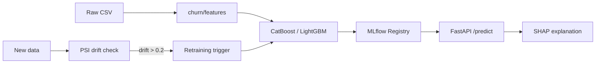

# 01 · Customer Churn MLOps

> **Business domain:** Telecom operator — retention campaign targeting  
> **Package:** `churn/`  
> **Directory:** `01-customer-churn-mlops/`

## What it solves

Predicts which customers are likely to churn in the next 30 days so the retention team can prioritise outreach. A 1% improvement in churn recall saves ~$200K/year at a mid-size telco (assuming $200 average lifetime value).

## Architecture



## Key components

### Feature engineering (`churn/features/`)
Polars-based pipeline: RFM metrics, tenure buckets, usage ratios, interaction terms.

### Model training (`train.py`)
- CatBoost with Optuna hyperparameter search (50 trials)
- LightGBM ensemble baseline
- Stratified K-Fold cross-validation (5 folds)
- MLflow experiment tracking + model registry

### API (`churn/api/app.py`)
| Endpoint | Method | Description |
|----------|--------|-------------|
| `/predict` | POST | Single customer churn probability + SHAP |
| `/batch` | POST | Batch predictions (CSV upload) |
| `/health` | GET | Service health + model version |
| `/retraining/notify` | POST | Receive drift alerts from Project 10 |

### Automated Retraining {#automated-retraining}

`churn/retraining/trigger.py` implements PSI-based drift detection:

- **PSI** (Population Stability Index) per feature, BCBS 2011 standard
- Retraining triggered when: `max_psi ≥ 0.2` **OR** `AUC drop ≥ 0.05`
- Full audit trail logged to MLflow for EU AI Act compliance
- Integrates with Project 10 drift alerts via `/retraining/notify`

```python
# PSI thresholds (BCBS 2011):
# PSI < 0.1  → no significant change
# PSI < 0.2  → minor change, monitor
# PSI ≥ 0.2  → major shift, retrain
```

## Streamlit Dashboard

```bash
cd 01-customer-churn-mlops
streamlit run streamlit_app.py
```

Features: customer risk scoring, SHAP waterfall charts, cohort analysis, retraining status.

## Running Tests

```bash
cd 01-customer-churn-mlops
../.venv/bin/python -m pytest tests/ -v --tb=short
```
