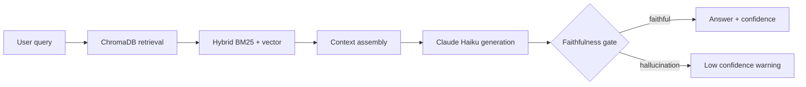

# 02 · RAG Enterprise

> **Business domain:** HR department — policy document Q&A  
> **Package:** `rag/`  
> **Directory:** `02-rag-enterprise/`

## What it solves

Employees ask questions in natural language; the system retrieves relevant policy passages and generates a grounded, faithful answer. Reduces HR query handling time by ~40% at a 500-person company.

## Architecture



## Key components

### Retrieval (`rag/retrieval/`)
- **ChromaDB** vector store with `sentence-transformers` embeddings
- Hybrid search: BM25 lexical + dense vector, MMR re-ranking

### Faithfulness Gate {#faithfulness-gate}

`rag/generation/faithfulness_gate.py` — Self-RAG inspired gate (arxiv 2310.11511):

- LLM mode: Claude Haiku checks if the answer is grounded in retrieved context
- Lexical fallback: n-gram overlap metric — works in CI without API keys
- Returns `FaithfulnessResult(is_faithful, confidence_score, reason)`

### RAGAS Evaluation (`rag/evaluation/ragas_eval.py`)
Four metrics without external LLM calls (CI-safe):

| Metric | Description |
|--------|-------------|
| `context_precision` | Retrieved docs relevance to query |
| `context_recall` | Coverage of ground truth answer |
| `answer_relevance` | Answer addresses the question |
| `faithfulness` | Answer supported by retrieved context |

### API (`rag/api/app.py`)
| Endpoint | Method | Description |
|----------|--------|-------------|
| `/query` | POST | Q&A with confidence score + source passages |
| `/ingest` | POST | Upload and index new documents |
| `/health` | GET | ChromaDB status + indexed doc count |

## Gradio UI

```bash
cd 02-rag-enterprise
uvicorn rag.api.app:app --reload
```

The Gradio interface shows answer text + faithfulness badge (green/yellow/red).

## Running Tests

```bash
cd 02-rag-enterprise
../.venv/bin/python -m pytest tests/ -v --tb=short
```
