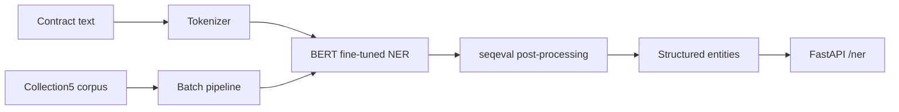

# 03 · NER Service

> **Business domain:** Legal department — entity extraction from contracts  
> **Package:** `ner/`  
> **Directory:** `03-ner-service/`

## What it solves

Automatically extracts named entities (persons, organisations, locations, dates) from legal documents. Reduces manual contract analysis from 2 hours to 5 minutes per document.

## Architecture



## Key components

### Model (`ner/model/`)
- `bert-base-multilingual-cased` fine-tuned for Russian/English NER
- Entity types: `PER` (person), `ORG` (organisation), `LOC` (location)
- seqeval metrics: entity-level Precision / Recall / F1

### Collection5 Dataset {#collection5}

`ner/data/collection5.py` — CoNLL-format parser for the Collection5 corpus:

- Russian named entity recognition benchmark
- 8-sentence built-in sample for CI without network access
- `compute_dataset_stats()` — entity distribution analysis
- `compute_metrics()` — seqeval-based evaluation

### Batch Processing (`ner/model/batch.py`)
- `BatchItem` / `BatchResult` dataclasses
- `process_texts()` — parallel processing with configurable batch size
- `process_collection5()` — benchmark evaluation pipeline

### API (`ner/api/app.py`)
| Endpoint | Method | Description |
|----------|--------|-------------|
| `/ner` | POST | Extract entities from text |
| `/ner/batch` | POST | Batch entity extraction |
| `/health` | GET | Model loaded status |

## Running Tests

```bash
cd 03-ner-service
../.venv/bin/python -m pytest tests/ -v --tb=short
```
