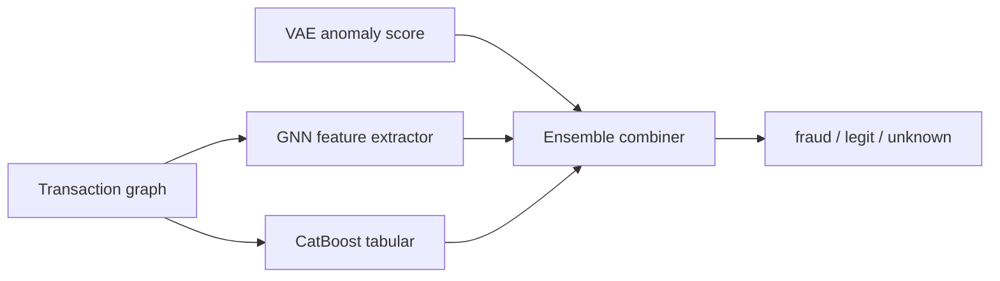

# 04 · Graph Fraud Detection

> **Business domain:** FinTech — anti-fraud for P2P payment platform  
> **Package:** `fraud/`  
> **Directory:** `04-graph-fraud-detection/`

## What it solves

Detects fraudulent Bitcoin transactions using graph structure (transaction network) and node features. The Elliptic dataset represents real-world blockchain data labeled by forensic experts.

## Architecture



## Key components

### Elliptic Bitcoin Dataset {#elliptic-dataset}

`fraud/data/elliptic.py` — 49-timestep Bitcoin transaction graph:

- 203,769 nodes, 234,355 edges
- 166 node features (34 local + 72 aggregated + 60 temporal)
- Labels: `1` = illicit, `2` = licit, `0` = unknown
- `generate_mock_elliptic()` — deterministic mock for CI without Kaggle
- `get_labeled_split()` — binary label conversion (1→illicit, 2→licit)

### Graph Neural Network (`fraud/models/gnn/`)
- PyTorch Geometric GraphSAGE / GAT
- Temporal GNN across 49 time-steps
- Handles `unknown` label masking during training

### VAE Anomaly Detector {#vae}

`fraud/models/baseline/vae.py` — unsupervised fraud detection:

- Trained only on licit transactions (normal behaviour)
- Reconstruction error threshold = 95th percentile of training errors
- ELBO loss = MSE reconstruction + KL divergence
- Graceful fallback `is_available()` without PyTorch (macOS x86_64)

### API (`fraud/api/app.py`)
| Endpoint | Method | Description |
|----------|--------|-------------|
| `/predict` | POST | Fraud probability for transaction |
| `/graph` | POST | Subgraph analysis (neighbourhood) |
| `/health` | GET | Model status |

## Running Tests

```bash
cd 04-graph-fraud-detection
../.venv/bin/python -m pytest tests/ -v --tb=short
```
