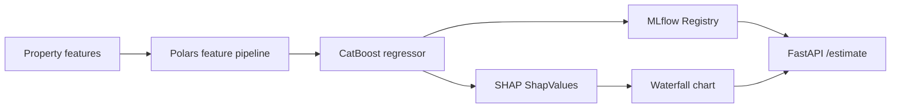

# 07 · Real Estate Pricing

> **Business domain:** Property marketplace — listing price estimation  
> **Package:** `pricing/`  
> **Directory:** `07-realestate-pricing/`

## What it solves

Estimates fair market value for residential properties with per-prediction SHAP explanation. Sellers get an instant estimate with the top factors driving the price up or down, increasing listing trust and conversion.

## Architecture



## Key components

### Feature Engineering (`pricing/features/`)
- Polars lazy pipeline: area ratios, age buckets, floor normalisation
- H3 geo-indexing for neighbourhood price signals (hexagonal binning)

### CatBoost Model
- Optuna hyperparameter search (100 trials, Median Pruner)
- MLflow model registry: `pricing-model` → `Production` stage
- Calibrated prediction intervals (quantile regression)

### SHAP Explainability {#shap-explainability}

`pricing/models/explain.py` — per-prediction SHAP breakdown:

- CatBoost built-in `get_feature_importance(type='ShapValues')`
- `SHAPWaterfall` dataclass: base value + per-feature contributions
- `SHAPContribution` list sorted by absolute impact
- `explain_prediction()` → top N factors with direction (↑ raises / ↓ lowers price)

### API (`pricing/api/app.py`)
| Endpoint | Method | Description |
|----------|--------|-------------|
| `/estimate` | POST | Price estimate + SHAP waterfall |
| `/compare` | POST | Compare two properties |
| `/health` | GET | Model version + registry status |

Example response:
```json
{
  "predicted_price": 12500000,
  "confidence_interval": [11800000, 13200000],
  "top_factors": [
    {"feature": "total_area", "contribution": +850000, "direction": "raises"},
    {"feature": "floor",      "contribution": -120000, "direction": "lowers"}
  ],
  "shap_base_value": 9500000
}
```

### Streamlit Dashboard

```bash
cd 07-realestate-pricing
streamlit run streamlit_app.py
```

Interactive property valuation form with live SHAP waterfall chart.

## Running Tests

```bash
cd 07-realestate-pricing
../.venv/bin/python -m pytest tests/ -v --tb=short
```
