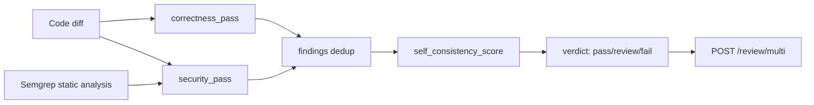

# 08 · LLM Code Review

> **Business domain:** DevTools — AI-powered PR review assistant  
> **Package:** `review/`  
> **Directory:** `08-llm-code-review/`

## What it solves

Automatically reviews code diffs for correctness bugs and OWASP Top 10 security vulnerabilities before human review. Reduces review cycle time and catches security issues that humans often miss under time pressure.

## Architecture



## Key components

### Multi-Model Review {#multi-model}

`review/models/multi_review.py` — two-pass review pipeline (Ericsson 2025, arxiv 2507.19115):

**Pass 1 — Correctness** (`correctness_pass`):
- Checks logic errors, off-by-one, null handling, resource leaks
- Claude Haiku with structured JSON output

**Pass 2 — Security** (`security_pass`):
- OWASP Top 10 categories: SQL injection, XSS, IDOR, secrets, etc.
- `SemgrepFinding` dataclass injects static analysis results into LLM context
- Combined static + semantic security analysis

**Self-Consistency Score** (`self_consistency_score`):
- Heuristic CISC scorer (0–1), no extra LLM call required
- Agreement between correctness and security passes + severity weighting

**Verdict** logic:
| Verdict | Condition |
|---------|-----------|
| `pass` | No issues found |
| `review_required` | Minor / low-severity issues |
| `fail` | Critical security or correctness bug |
| `api_key_missing` | Graceful degradation in CI |

### API (`review/api/app.py`)
| Endpoint | Method | Description |
|----------|--------|-------------|
| `/review` | POST | Single-pass review |
| `/review/multi` | POST | Two-pass multi-model review + verdict |
| `/health` | GET | API key status |

### Gradio UI

```bash
cd 08-llm-code-review
uvicorn review.api.app:app --reload
```

Paste a diff, get structured findings with severity labels and remediation hints.

## Running Tests

```bash
cd 08-llm-code-review
../.venv/bin/python -m pytest tests/ -v --tb=short
```
