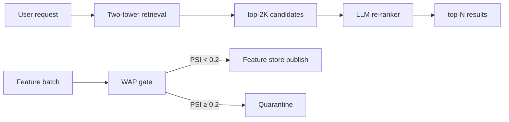

# 09 · RecSys Feature Store

> **Business domain:** E-commerce — personalised product recommendations  
> **Package:** `recsys/`  
> **Directory:** `09-recsys-feature-store/`

## What it solves

Delivers personalised product recommendations with a two-tower neural model and LLM re-ranking for contextual relevance. The WAP gate ensures only drift-free features enter the serving layer.

## Architecture



## Key components

### MovieLens-25M Dataset {#movielens}

`recsys/data/movielens.py` — 25M ratings from 162K users on 62K movies:

- `generate_mock_movielens()` — power-law activity distribution for CI
- `load_movielens(path)` — real dataset with graceful fallback
- `compute_movielens_stats()` — sparsity, avg rating, top genres
- `to_recsys_format()` — converts to internal format with ISO timestamps

### Two-Tower Model {#two-tower}

`recsys/models/two_tower.py` — numpy/sklearn implementation (macOS x86_64 compatible):

- **UserTower**: user ID + history → 64-dim embedding
- **ItemTower**: item ID + features → 64-dim embedding
- In-batch negative sampling + softmax cross-entropy loss
- L2-normalised item embeddings for fast cosine ANN
- `evaluate()` → Precision@K / Recall@K / NDCG@K
- `save()` / `load()` for model persistence

### LLM Re-ranker {#llm-reranker}

`recsys/models/reranker.py` — retrieve → re-rank pipeline:

- Retrieves `2×top_k` candidates from two-tower
- Claude Haiku re-ranks with user profile context
- Mock mode without API key (CI safe)
- Graceful degradation on LLM errors → returns retrieval order

### WAP Gate (Write-Audit-Publish) {#wap-gate}

`recsys/feature_store/wap.py` — data quality gate for feature store:

- **Write**: accept feature batch (draft)
- **Audit**: compute PSI vs reference distribution (BCBS 2011, threshold=0.2)
- **Publish**: merge to feature store if `PSI < 0.2`, else quarantine
- Cold-start: first batch auto-publishes and sets reference
- `AuditResult` dataclass: `status` · `psi` · `reason` · `draft_id`

### API (`recsys/api/app.py`)
| Endpoint | Method | Description |
|----------|--------|-------------|
| `/recommend` | POST | Top-N recommendations for user |
| `/recommend/reranked` | POST | Two-tower + LLM re-rank |
| `/features/wap` | POST | Feature batch with WAP audit |
| `/health` | GET | Model + feature store status |

## Running Tests

```bash
cd 09-recsys-feature-store
../.venv/bin/python -m pytest tests/ -v --tb=short
```
