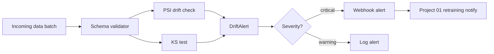

# 10 · Data Quality Platform

> **Business domain:** Data platform team — data observability  
> **Package:** `quality/`  
> **Directory:** `10-data-quality-platform/`

## What it solves

Monitors data pipelines for schema violations, distribution drift, and anomalous values. Alerts downstream consumers before bad data reaches production models, preventing silent failures.

## Architecture



## Key components

### Drift Detection (`quality/monitoring/`)
- **PSI** (Population Stability Index): BCBS 2011 standard, threshold 0.2
- **KS test** (Kolmogorov-Smirnov): for continuous distribution comparison
- DuckDB for fast column profiling on large datasets (100M+ rows)

### Alert System {#alerting}

`quality/alerts/alerting.py` — multi-channel alerting framework:

- `DriftAlert` dataclass: `feature` · `psi` · `severity` · `timestamp`
- `LogAlertChannel` — structured JSON logs (always available)
- `WebhookAlertChannel` — HTTP POST to downstream consumers
- `AlertManager` — severity threshold filtering + channel isolation
  (one failing channel doesn't block others)

**Severity levels:**

| Severity | PSI | Action |
|----------|-----|--------|
| `ok` | < 0.1 | No action |
| `warning` | 0.1–0.2 | Log + notify |
| `critical` | ≥ 0.2 | Alert + trigger retraining |

### Integration with Project 01

When critical drift is detected, `AlertManager` fires a webhook to `churn/api/app.py → /retraining/notify`. The churn service then evaluates whether to trigger model retraining:

- `critical` → always retrain
- `warning` + PSI ≥ 0.2 → retrain
- otherwise → skip, log for review

### API (`quality/api/app.py`)
| Endpoint | Method | Description |
|----------|--------|-------------|
| `/profile` | POST | Column-level statistics |
| `/drift` | POST | PSI + KS drift check |
| `/drift/alert` | POST | Drift check + multi-channel alerting |
| `/schema/validate` | POST | Schema contract validation |
| `/health` | GET | DuckDB + alert channel status |

## Running Tests

```bash
cd 10-data-quality-platform
../.venv/bin/python -m pytest tests/ -v --tb=short
```
